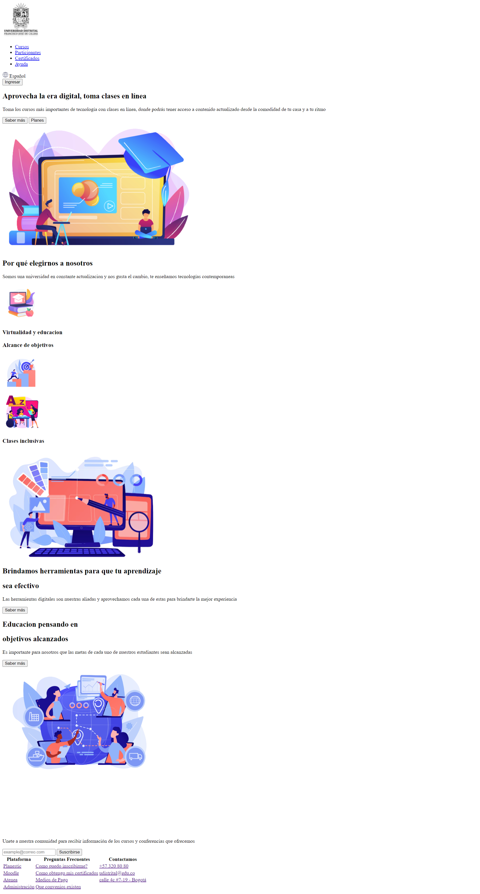

<h1>Taller 9 - Miguel Angel Villalobos Espinosa</h1>
<h2>Información</h2>

Curso: Full Stack Básico - Grupo 1

Profesor: Cristian Patiño

<h2>Link de la página web</h2>

<h2>Punto 1: Link de figma</h2>

<a href="https://www.figma.com/file/0k07ujuPbsS1sKnqfb5X3j/Miguel-Angel-Villalobos-Espinosa?type=design&node-id=0%3A1&mode=design&t=wDcE5J3mRgHrW0QT-1">Link de figma</a>

<h2>Punto 2: Diseño HTML</h2>
    

<h2>Punto 3: Diseño CSS</h2>

<h2>Punto 4: Títulos</h2>

<h2>Punto 5: Párrafo</h2>

<h2>Punto 6: Links</h2>

<h2>Punto 7 y 8: Navegación</h2>

<h2>Punto 9: Tabla</h2>